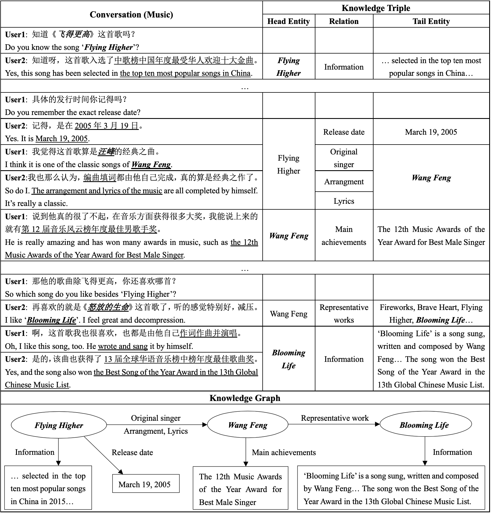

# KdConv

KdConv is a Chinese multi-domain **K**nowledge-**d**riven **Conv**ersionsation dataset, grounding the topics in multi-turn conversations to knowledge graphs. KdConv contains **4.5K** conversations from **three** domains (film, music, and travel), and **86K** utterances with an average turn number of **19.0**. These conversations contain in-depth discussions on related topics and natural transition between multiple topics, while the corpus can also used for exploration of transfer learning and domain adaptation.

We provide several benchmark models to facilitate the following research on this corpus. (The benchmark codes will be released later)

If you have any question, feel free to open an issue.

If the corpus is helpful to your research, please kindly cite our paper:

```
@inproceedings{zhou-etal-2020-kdconv,
    title = "{KdConv}: A Chinese Multi-domain Dialogue Dataset Towards Multi-turn Knowledge-driven Conversation",
    author = "Zhou, Hao  and
      Zheng, Chujie  and
      Huang, Kaili   and
      Huang, Minlie  and
      Zhu, Xiaoyan",
    booktitle = "Proceedings of the 58th Conference of the Association for Computational Linguistics",
    month = jul,
    year = "2020",
}
```

## Example

An example of the conversation with annotations in our corpus:



Each utterance in the conversation is annotated with referred knowledge graph triplets. As the discussion deepens, the conversation will also transition between multiple topics.

## Data

The data files are in the `./data` folder. It contains three domains film/music/travel, and each domain folder includes split sets  `train/dev/test.json` and the corresponding knowledge base file `kb_DOMAIN.json` that was used to collect and construct the corpus. 

We take the music domain for instance. After loading `train.json`, you will get a list of conversations. Each conversation looks like the following:

```python
{
  "messages": [
    {
      "message": "对《我喜欢上你时的内心活动》这首歌有了解吗？"
    },
    {
      "attrs": [
        {
          "attrname": "Information",
          "attrvalue": "《我喜欢上你时的内心活动》是由韩寒填词，陈光荣作曲，陈绮贞演唱的歌曲，作为电影《喜欢你》的主题曲于2017年4月10日首发。2018年，该曲先后提名第37届香港电影金像奖最佳原创电影歌曲奖、第7届阿比鹿音乐奖流行单曲奖。",
          "name": "我喜欢上你时的内心活动"
        }
      ],
      "message": "有些了解，是电影《喜欢你》的主题曲。"
    },
    ...
    {
      "attrs": [
        {
          "attrname": "代表作品",
          "attrvalue": "旅行的意义",
          "name": "陈绮贞"
        },
        {
          "attrname": "代表作品",
          "attrvalue": "时间的歌",
          "name": "陈绮贞"
        }
      ],
      "message": "我还知道《旅行的意义》与《时间的歌》，都算是她的代表作。"
    },
    {
      "message": "好，有时间我找出来听听。"
    }
  ],
  "name": "我喜欢上你时的内心活动"
}
```

- `name` is the starting topic (entity) of the conversation

- `messages` is a list of all the turns in the dialogue. For each turn:

  - `message` is the utterance

  - `attrs` is a list of knowledge graph triplets referred by the utterance. For each triplet:

    - `name` is the head entity
    - `attrname` is the relation
    - `attrvalue` is the tail entity

    Note that the triplets where `attrname` is 'information' are the unstructured knowledge about the head entity.

After loading `kb_music.json`, you will get a dictionary. Each item looks like the following:

```python
"忽然之间": [
  [
    "忽然之间",
    "Information",
    "《忽然之间》是歌手 莫文蔚演唱的歌曲，由 周耀辉， 李卓雄填词， 林健华谱曲，收录在莫文蔚1999年发行专辑《 就是莫文蔚》里。"
  ],
  [
    "忽然之间",
    "谱曲",
    "林健华"
  ]
  ...
]
```

The key is a head entity, and the value is a list of corresponding triplets. 

